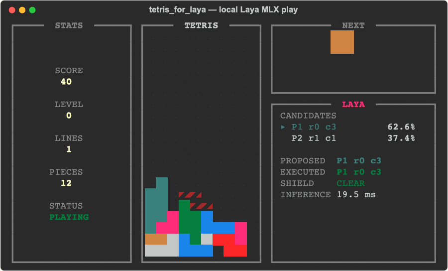

# tetris_for_laya

A pure-Python Rich terminal Tetris environment where a local Laya model plays one keyboard
action at a time on Apple Silicon.



The GIF above is an archived demo of the earlier planner-assisted policy, not the current
independent-decision version. It records consecutive real game states from the multilingual
MLX checkpoint, seed 7.
Every frame follows one fresh Laya decision and one executed input. The GIF is replayed at the
measured average tick rate of the recorded run, without interpolated movement or a preselected
landing animation.

The game engine is implemented independently. Its restrained three-column terminal presentation
is inspired by [`samtay/tetris`](https://github.com/samtay/tetris), and its model integration follows
the typed decision interface demonstrated by
[`mizorewww/laya-mlx`](https://github.com/mizorewww/laya-mlx).

## Highlights

- Deterministic 10 × 20 Tetris with a seeded 7-bag, wall kicks, ghost pieces, scoring and levels
- Local FP16 inference through `laya-mlx`; no cloud API and no downloads during play
- A fresh model decision for every LEFT, RIGHT, ROTATE, DOWN or WAIT action
- Visible action probabilities, proposed/executed keys, step count and inference latency
- An input legality guard whose replacements are labeled and counted
- Human keyboard mode using the same engine and Rich interface

## Requirements

- Apple Silicon Mac running macOS 14 or later
- Python 3.11 or later (`uv` will select an installed compatible Python)
- A true-color terminal at least 78 columns × 22 rows
- About 700 MiB for the default multilingual checkpoint

## Install

```bash
uv sync --extra dev --python 3.12
uv run hf download aac6fef/laya-multilingual-mlx \
  --local-dir models/laya-multilingual-mlx
```

If Hugging Face is unreachable through the direct connection:

```bash
export all_proxy=http://127.0.0.1:7897
uv run hf download aac6fef/laya-multilingual-mlx \
  --local-dir models/laya-multilingual-mlx
```

The model is downloaded explicitly. Gameplay enables Hugging Face offline mode and never downloads
weights in the middle of a run.

## Play

Let Laya play, one typed decision per keyboard action:

```bash
uv run tetris-for-laya
```

Play manually:

```bash
uv run tetris-for-laya --player human
```

Manual controls:

| Action | Keys |
|---|---|
| Move | `←` / `→` or `h` / `l` |
| Rotate | `↑` or `k` |
| Soft drop | `↓` or `j` |
| Hard drop | `Space` |
| Restart | `r` |
| Quit | `q`, `Esc`, or `Ctrl-C` |

Run a finite, non-rendered model check:

```bash
uv run tetris-for-laya --headless --pieces 150 --seed 7
```

Other useful flags:

```text
--model PATH       Local MLX checkpoint (default: models/laya-multilingual-mlx)
--level 0..9       Starting level
--fps 1..240       Optional action-rate cap; default runs as fast as Laya completes each tick
--optimize         Enable MLX compilation and the bounded prompt cache
--no-alt-screen    Leave the final Rich frame in terminal scrollback
```

`--optimize` has a noticeable first-use compilation cost and is intended for longer runs; eager
mode is the better default for a quick game.

## Compare with online Jev

Online Jev uses the **same state, instruction, action descriptions, eight-step history and legality
guard** as local Laya. Only the inference backend changes. Gravity still advances by input count,
so network latency changes wall-clock speed, not the number of moves available before a piece falls.
The API receives the complete shared prompt; Laya additionally encodes it with its local tokenizer.

Set the token locally and start a bounded run:

```bash
export TYPESAFE_API_KEY="your-token"
uv run tetris-for-laya --player jev --seed 7 --pieces 20 --steps 2000
```

Jev needs no local checkpoint and no additional Python dependencies. `--steps` caps engine inputs
and API calls; each step makes one paid API request. Press Q to quit between requests, or Ctrl-C
to interrupt a pending request. The UI labels the backend JEV. The summary includes the actual
model version returned by the API, seed, input tokens, decisions and legality-guard interventions.
There are no automatic retries or fallback to local inference on errors.

For a headless comparison with identical limits:

```bash
uv run tetris-for-laya --player jev --headless --seed 7 --pieces 20 --steps 2000
uv run tetris-for-laya --player laya --headless --seed 7 --pieces 20 --steps 2000
```

`--jev-model` defaults to `jev-latest`; pin a supported model ID for repeatable comparisons.
`--jev-timeout` defaults to 30 seconds. Use `--fps 1` if you need a lower request rate.
HTTP(S) proxy environment variables are supported by the standard-library HTTP client.
For an HTTP or mixed proxy listener (replace the port with your proxy's actual port):

```bash
export HTTPS_PROXY="http://127.0.0.1:7897"
```

The endpoint and payload follow the [TypeSafe quick start](https://docs.typesafe.ai/introduction/quickstart).

## What Laya actually does

This is a feature-assisted typed-decision environment, not an end-to-end vision agent.

Each control cycle observes the current piece position, rotation and gravity phase, then asks Laya
one `choice` question over five actions:

| Key | Immediate effect |
|---|---|
| `LEFT` | Move one column left if unobstructed |
| `RIGHT` | Move one column right if unobstructed |
| `ROTATE` | Rotate clockwise once, using the same wall kicks as human play |
| `DOWN` | Move one row down, or lock if already resting |
| `WAIT` | Leave the piece alone and let the natural gravity clock advance |

One game tick performs one fresh inference, applies exactly one input and renders the resulting
state. The next tick starts immediately after that cycle completes: no fixed sleep, overlapping
inference or queued actions. A piece usually takes many model calls to settle. The agent never calls
the atomic placement or hard-drop helpers. Its controls use deterministic simulation time: gravity
advances one row every four inputs,
including blocked inputs. `DOWN` on that fourth input counts as the gravity row, so it never drops
twice. A newly spawned piece is not moved by the previous piece's locking input. An explicit `--fps`
adds a rate cap for slow observation without changing physics. Headless mode uses the same tick loop.

The model observes all 20 board rows (`#` fixed, `.` empty), the current piece's position,
rotation and occupied cells, the next piece's spawn shape, the gravity clock and basic rules.
The last eight confirmed inputs for the current piece include before/after poses; history clears
on spawn. Action descriptions contain only their meaning and immediate input legality.

The policy does not search landings, calculate future board scores, recommend actions or reject
poor strategic decisions. Legal reversals, waiting and moves that lose the game are left to Laya.
If a proposal is unknown or blocked, the input guard selects the model's highest-probability legal
key, including WAIT. DOWN is legal while resting because it locks the piece. Original probabilities
remain visible; any replacement is labeled `SHIELD APPLIED` and counted.

The short instruction is adapted from the Laya request in
[`trungdq88/jev-tetris`](https://github.com/trungdq88/jev-tetris/blob/HEAD/public/players.js):
“Pick the best keyboard action: clear lines, avoid holes, keep the stack low and flat.”
Only “placement” is changed to “keyboard action”; our candidates remain single-step controls.

Laya truncates each option to 48 tokens and shares a small prefix budget between instructions
and options. A checkpoint-tokenizer regression verifies that the complete instruction, options,
board and eight-step history survive encoding, including a densely occupied board. It is skipped
when the local tokenizer is unavailable. Earlier planner-assisted results do not describe this
independent-decision policy.

## Current result and limitations

The independent policy currently plays poorly. In a local seed-7 run with the multilingual MLX
checkpoint, it topped out after **16 pieces and 657 inputs, clearing 0 lines**. The model proposed
RIGHT 561 times and LEFT 96 times. The legality guard replaced 266 blocked inputs using the
model's own highest-probability legal alternative; it did not optimize placements. Executed inputs
were RIGHT 351, LEFT 305 and DOWN 1.

This is one observed run, not a multi-seed benchmark. Providing the board and keeping the prompt
within the token budget did not produce effective placement planning. The repository is a working
local decision-model experiment, not a claim of strong autonomous Tetris play. The diagnostic run
limited the MLX allocator cache to 64 MiB after an earlier process was terminated; that cache limit
is not enabled by default in the gameplay CLI.

## Architecture

```text
src/tetris_for_laya/
├── game.py    deterministic single-step rules, pure previews, snapshots and board metrics
├── policy.py  board observation, per-action Laya prompt and input legality guard
├── ui.py      pure Rich renderables; no model or game-loop side effects
└── cli.py     observe → decide → step → render loop and headless runner
```

## Verify

```bash
uv run pytest -q
uv run ruff check .
uv run ruff format --check .
```

The regressions check real intermediate motion, collisions, gravity timing, lock/spawn transitions,
repeated inference and that neither atomic placement nor hard drop can be used by the Laya loop.

To record a fresh demo on macOS (requires FFmpeg and the downloaded model):

```bash
uv run python scripts/record_demo.py
```

The recorder uses the same policy, `game.step()` and Rich renderer, saving every consecutive step.
Only the resulting GIF is kept; temporary rendering frames are removed automatically.

## References and acknowledgements

- [`mizorewww/laya-mlx`](https://github.com/mizorewww/laya-mlx) provides the native MLX runtime and
  the Snake demo that inspired this environment's typed-decision and visible-shield integration.
- [`NandhaKishorM/laya`](https://github.com/NandhaKishorM/laya) is the upstream Laya implementation
  and training project.
- [`aac6fef/laya-multilingual-mlx`](https://huggingface.co/aac6fef/laya-multilingual-mlx) is the
  pre-converted FP16 checkpoint used by default.
- [`samtay/tetris`](https://github.com/samtay/tetris) inspired the restrained terminal visual
  grammar. No source code or assets were copied.

This repository is MIT-licensed. Laya, `laya-mlx`, their model weights and their dependencies retain
their respective licenses and notices.
